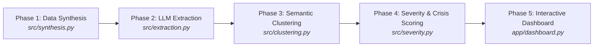

# 🚆 Transit Pulse — Railway Complaint Intelligence Dashboard


**Transit Pulse** is an end-to-end AI-powered complaint intelligence platform designed for railway operations (inspired by Indian Railways passenger grievance systems). It automatically ingests multi-lingual, code-mixed complaints (English, Hindi, Hinglish), extracts structured entity metadata using LLMs, clusters complaints semantically, calculates dynamic Crisis Scores, and visualizes real-time hot-spots on an interactive dashboard.

---

## 🏗️ Architecture & Pipeline Overview



### Pipeline Breakdown

| Phase | Module | Tech Stack | Description |
| :--- | :--- | :--- | :--- |
| **Phase 1** | `src/synthesis.py` | Groq API (`llama-3.1-8b-instant`) | Generates 200 diverse, multi-lingual passenger complaints with pre-assigned ground-truth metadata. |
| **Phase 2** | `src/extraction.py` | LLM NER Prompt Engineering | Extracts `extracted_train_number`, `extracted_coach_number`, and `extracted_issue_category`. Includes 20-row validation sample accuracy benchmarking. |
| **Phase 3** | `src/clustering.py` | `SentenceTransformers` + KMeans + PCA | Generates 384-dim text embeddings (`all-MiniLM-L6-v2`), clusters complaints into $K=8$ groups, and projects vectors to 2D for interactive mapping. |
| **Phase 4** | `src/severity.py` | Custom Heuristic Engine + `src/crisis_utils.py` | Assigns 1-5 severity scores based on category baselines & keyword boosting. Computes aggregate **Crisis Scores** per Train/Coach group. |
| **Phase 5** | `app/dashboard.py` | Streamlit + Plotly Express | Modern dark-mode UI with KPI topbar, exact train filter, interactive PCA scatter plot, cluster inspect cards with URGENT badges, and export capabilities. |

---

## ✨ Key Features

- **Multi-lingual & Code-Mixed NLP:** Seamlessly processes Hindi written in Latin script, Hinglish, and plain English.
- **LLM Information Extraction:** Uses structured JSON mode to parse unstructured passenger text into actionable train & coach metadata.
- **NER Accuracy Benchmarking:** Automatically calculates and stores precision scores for entity extraction (Train: 85%, Coach: 90%, Category: 75%).
- **Semantic Clustering:** Groups complaints by semantic meaning rather than basic keyword matching.
- **Dynamic Crisis Scoring Formula:**
  $$\text{Crisis Score} = (\text{Complaint Count} \times \text{Average Severity}) + (\text{Max Severity} \times 2)$$
- **Interactive PCA Map:** Hover over vector embeddings to read raw complaint text, train numbers, and severity directly on the chart.
- **Portable Architecture:** Zero-crash imports, clean modular utility isolation (`src/crisis_utils.py`), and robust string normalization for float edge-cases.

---

## 📁 Repository Structure

```text
transit-pulse/
├── app/
│   └── dashboard.py               # Streamlit interactive UI dashboard
├── src/
│   ├── synthesis.py               # Phase 1: Synthetic complaint generator (Groq API)
│   ├── extraction.py              # Phase 2: LLM Named Entity Recognition
│   ├── clustering.py              # Phase 3: SentenceTransformers, KMeans & PCA
│   ├── crisis_utils.py            # Shared utility: Crisis score & grouping logic
│   ├── severity.py                # Phase 4: Severity scoring engine
│   └── extract_real_tweets.py     # Utility script for real tweets dataset parsing
├── data/
│   ├── synthetic_complaints.csv       # Phase 1 output
│   ├── extraction_validation.csv      # Phase 2 validation sample
│   ├── extraction_accuracy.json       # Phase 2 precision metrics
│   ├── extracted_complaints.csv       # Phase 2 full 200-row extraction output
│   ├── clustered_complaints.csv       # Phase 3 clustering & PCA output
│   ├── crisis_report.csv              # Phase 4 crisis ranking report
│   └── final_processed_complaints.csv # Phase 4 final dataset with severity scores
├── transit_pulse_architecture.md  # Detailed technical architecture doc
├── requirements.txt               # Dependencies list
├── README.md                      # Project documentation
└── .env                           # Environment variables configuration (API keys)
```

---

## ⚡ Quick Start & Installation

### 1. Prerequisites
- Python 3.10 or higher
- A free **Groq API Key** (for Llama-3.1 inference)

### 2. Clone & Setup Virtual Environment
```bash
git clone https://github.com/YOUR_USERNAME/transit-pulse.git
cd transit-pulse

# Create and activate virtual environment
python -m venv venv

# On Windows (PowerShell):
.\venv\Scripts\Activate.ps1

# On Linux/macOS:
source venv/bin/activate
```

### 3. Install Dependencies
```bash
pip install -r requirements.txt
```

### 4. Configure Environment Variables
Create a `.env` file in the project root directory:
```env
GROQ_API_KEY=your_actual_groq_api_key_here
```

---

## 🚀 Running the Pipeline

You can run the pipeline sequentially from the project root:

```bash
# Step 1: Generate synthetic complaints
python -m src.synthesis

# Step 2: Extract entities via Groq API (Validation + Full dataset)
python -m src.extraction

# Step 3: Compute embeddings, KMeans clusters, and 2D PCA projection
python -m src.clustering

# Step 4: Calculate severity scores and crisis alerts
python -m src.severity

# Step 5: Launch the Streamlit Dashboard
streamlit run app/dashboard.py
```

---

## 📊 Dashboard Preview

When running `streamlit run app/dashboard.py`, open your browser at `http://localhost:8501`:

- **Topbar KPIs:** Total Complaints, Severe Complaints %, Active Trains, Unique Coaches.
- **Filtered Controls:** Select specific trains or severity levels.
- **Interactive PCA Map:** Powered by Plotly Express with custom brand color palettes and line-wrapped hover tooltips.
- **Cluster Inspect Cards:** Badged with `URGENT`, `MODERATE`, or `MINOR` based on `max-sev` scores, featuring quick samples and issue chips.
- **Export Center:** Download filtered complaints CSV or the full `transit_pulse_architecture.md` tech document directly from the web interface.

---

## 🤝 Tech Stack & Dependencies

- **Language:** Python 3.10+
- **LLM Provider:** Groq (`llama-3.1-8b-instant`)
- **NLP / Embeddings:** `sentence-transformers` (`all-MiniLM-L6-v2`)
- **Machine Learning:** `scikit-learn` (KMeans, PCA)
- **Data Manipulation:** `pandas`, `numpy`
- **Visualization & Web UI:** `streamlit`, `plotly`
